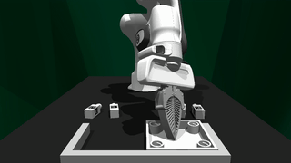
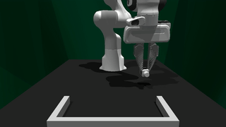
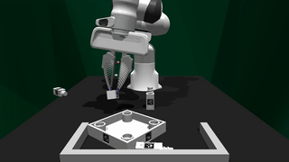
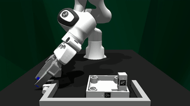
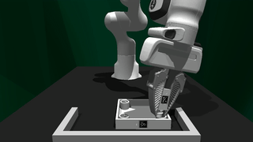
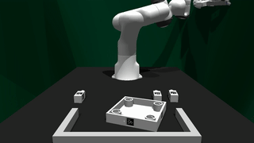
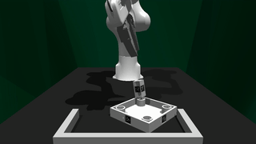

# TRANSIC-Envs: Simulation Environments for Sim-to-Real Policy Transfer
<div align="center">

[Yunfan Jiang](https://yunfanj.com/),
[Chen Wang](https://www.chenwangjeremy.net/),
[Ruohan Zhang](https://ai.stanford.edu/~zharu/),
[Jiajun Wu](https://jiajunwu.com/),
[Li Fei-Fei](https://profiles.stanford.edu/fei-fei-li)


**Conference on Robot Learning (CoRL) 2024**

[[Website]](https://transic-robot.github.io/)
[[arXiv]](https://arxiv.org/abs/2405.10315)
[[PDF]](https://transic-robot.github.io/assets/pdf/transic_paper.pdf)
[[Algorithm Code]](https://github.com/transic-robot/transic)
[[Model Weights]](https://huggingface.co/transic-robot/models)
[[Training Data]](https://huggingface.co/datasets/transic-robot/data)

[](https://github.com/transic-robot/transic-envs)
[](https://developer.nvidia.com/isaac-gym)
[](https://github.com/transic-robot/transic-envs/blob/main/LICENSE)


______________________________________________________________________
</div>

TRANSIC-Envs is a collection of simulation environments built on [IsaacGym](https://developer.nvidia.com/isaac-gym) to support sim-to-real transfer of contact-rich robotic arm manipulation tasks. It is used in our [CoRL paper](https://arxiv.org/abs/2405.10315) "TRANSIC: Sim-to-Real Policy Transfer by Learning from Online Correction".

It extends the FurnitureSim from the [FurnitureBench paper](https://clvrai.github.io/furniture-bench/) by supporting massive environment parallelization, point-cloud observations, and joint position actions. With our TRANSIC method, policies trained in the simulation can transfer to the real world and accomplish complex tasks, such as assembling the square table from FurnitureBench. Checkout videos on our [website](https://transic-robot.github.io/)!

## Table of Contents
1. [Installation](#Installation)
2. [Usage](#usage)
3. [Acknowledgement](#acknowledgement)
4. [Check out Our Paper](#check-out-our-paper)
5. [License](#license)

## Installation
First create a virtual environment named `transic` with Python 3.8. Note that IsaacGym only supports Python versions up to 3.8.

```bash
conda create -y -n transic python=3.8
conda activate transic
```

Download the IsaacGym Preview 4 release from the [website](https://developer.nvidia.com/isaac-gym), then follow the installation instructions in the documentation. Ensure that IsaacGym works on your system by running one of the examples from the `python/examples` directory, like `joint_monkey.py`.

Once IsaacGym works, clone this repo and install it.
```bash
git clone https://github.com/transic-robot/transic-envs
cd transic-envs
pip3 install -e .
```

## Usage

### Overview
To show all supported tasks, run
```python
import transic_envs
print(transic_envs.TASK_MAP.keys())

>>> ['InsertFull',
     'InsertFullPCD',
     'InsertSingle',
     'InsertSinglePCD',
     'LiftLeanedLeg',
     'LiftLeanedLegPCD',
     'ReachAndGraspFull',
     'ReachAndGraspFullPCD',
     'ReachAndGraspSingle',
     'ReachAndGraspSinglePCD',
     'ScrewFull',
     'ScrewFullPCD',
     'ScrewSingle',
     'ScrewSinglePCD',
     'Stabilize',
     'StabilizePCD']
```

|         Task          |                                                   Description                                                    |                   Visualization                    |
|:---------------------:|:----------------------------------------------------------------------------------------------------------------:|:--------------------------------------------------:|
|      `Stabilize`      | Push the tabletop into the right corner of the wall such that it remains stable in the following assembly steps. |               |
| `ReachAndGraspSingle` |                                       Reach and grasp a single table leg.                                        |  |
|  `ReachAndGraspFull`  |                          Reach and grasp a table leg with other assembly parts present.                          |    |
|    `LiftLeanedLeg`    |   Lift a table leg leaned against the wall such that it aligns with gripper fingers for the ease of insertion.   |         |
|    `InsertSingle`     |                      Insert a pre-grasped table leg into the assembly hole of the tabletop.                      |           |
|     `InsertFull`      |     Insert a pre-grasped table leg into the assembly hole of the tabletop with other assembly parts present.     |             |
|     `ScrewSingle`     |                               Screw an inserted table leg into the assembly hole.                                |            |
|      `ScrewFull`      |              Screw an inserted table leg into the assembly hole with other assembly parts present.               |              |


### Observation Space and Action Space
Tasks without the `PCD` suffix are for teacher policy learning through RL. Tasks with the `PCD` suffix are for student policy distillation.
For teacher policies, the observation space includes proprioception and privileged information about objects, such as pose and velocity. For example:
```yaml
propObsDim: 29
obsKeys:
  - q
  - ...

privilegedObsDim: 130
privilegedObsKeys:
  - square_table_top_vel
  - ...
```
For student policies, the observation space only includes proprioception and point cloud. These are easily obtained in the real world.

In terms of the action space, teacher policies are trained with delta end-effector poses, while student policies are trained with joint positions, plus a binary gripper action for both.

```python
# teacher policy
Box(-1.0, 1.0, (7,), float32)

# student policy
Box(-1.0, 1.0, (8,), float32)
```

### Use with TRANSIC Policy Learning
For the detailed usage of TRANSIC-Envs for policy learning, please checkout our [algorithm codebase](https://github.com/transic-robot/transic). 

## Acknowledgement
We would like to acknowledge the following open-source projects that greatly inspired our development.
- [FurnitureBench](https://github.com/clvrai/furniture-bench)
- [IsaacGymEnvs](https://github.com/NVIDIA-Omniverse/IsaacGymEnvs)

## Check out Our Paper
Our paper is posted on [arXiv](https://arxiv.org/abs/2405.10315). If you find our work useful, please consider citing us! 

```bibtex
@inproceedings{jiang2024transic,
  title     = {TRANSIC: Sim-to-Real Policy Transfer by Learning from Online Correction},
  author    = {Yunfan Jiang and Chen Wang and Ruohan Zhang and Jiajun Wu and Li Fei-Fei},
  booktitle = {Conference on Robot Learning},
  year      = {2024}
}
```

## License
| Component            | License                                                   |
|----------------------|-----------------------------------------------------------|
| Codebase (this repo) | [MIT License](LICENSE)                                    |
| Franka Asset         | [Apache License](assets/licenses/franka-LICENSE.txt)      |
| FurnitureBench Asset | [MIT License](assets/licenses/FurnitureBench-LICENSE.txt) |
